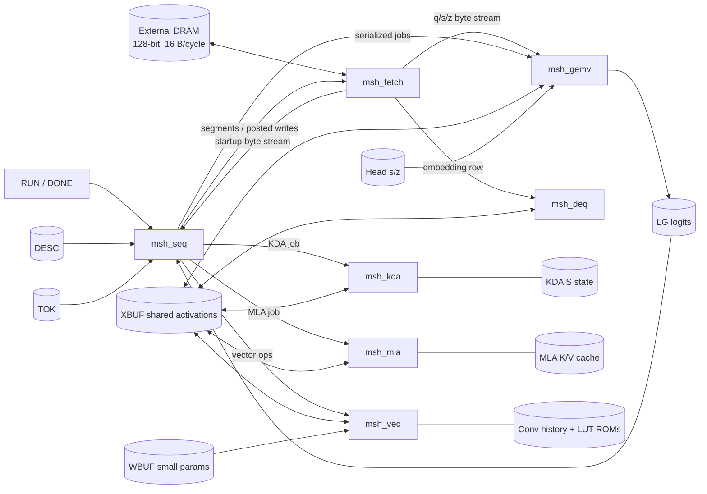
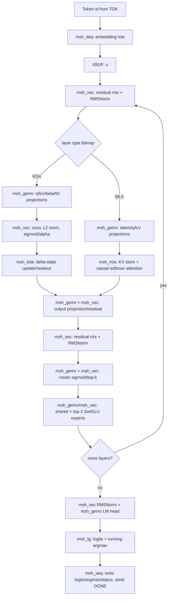

# nano-kpu RTL Structure Notes

Analyzed revision: `e1855debc4469dbfa09b18f34dfcdf9ac7b0f949` (`main`)

## 1. One-line summary

`msh_chip_top` is a microcoded/finite-state, mostly serialized token decoder: `msh_seq` interprets the model image and dispatches jobs to a shared int4 GEMV engine, vector-function unit, KDA recurrent-state unit, and MLA attention/KV-cache unit, while `msh_fetch` keeps the single 128-bit DRAM port occupied and shared macro SRAMs hold intermediate and resident data.

## 2. RTL hierarchy

```text
msh_chip_top
├── msh_seq        : whole-model sequencer; header/descriptor parser; engine dispatcher
├── msh_fetch      : latency-elastic DRAM segment reader, response FIFO, posted writes
│   ├── msh_sram   : response data FIFO
│   ├── msh_sram   : response metadata FIFO
│   └── msh_sram   : resident LM-head int4-q shadow buffer
├── msh_gemv       : int4 GEMV + fused zero/scale dequant; row/head modes
│   └── msh_sram[] : q/group accumulators, scale/zero staging, head scale buffer
├── msh_deq        : embedding-row int4 dequantizer
├── msh_vec        : RMS/L2 norm, LUT functions, residual mix, top-k, conv, elementwise ops
│   ├── msh_sram   : KDA convolution history
│   └── msh_rom[]  : sigmoid/alpha/exp/rsqrt/reciprocal LUTs
├── msh_kda        : KDA delta-rule recurrent state update/readout
│   └── msh_sram   : S state
├── msh_mla        : causal NoPE-MLA attention
│   ├── msh_sram[] : K/V caches, attention scores/exponents/context accumulators
│   └── msh_rom[]  : exp and reciprocal LUTs
├── msh_xbuf       : shared 16-buffer activation/intermediate scratchpad
├── msh_wbuf       : resident int16 small-parameter buffer
├── msh_desc       : tensor descriptor SRAM
├── msh_tok        : teacher-forced token SRAM
├── msh_hsz        : resident LM-head scale/zero SRAMs
└── msh_lg         : staged logits SRAM
```

## 3. Control and data flow



The key scheduling property is serialization: `msh_seq` issues one engine job, waits for completion, and then issues the next. Only `msh_fetch` runs ahead. Shared XBUF read/write ports are therefore selected with ownership muxes rather than a general concurrent arbiter.

## 4. Per-token computation mapped onto RTL



## 5. What is runtime-configurable vs structurally fixed

### Runtime-configurable from the memory-image header

- number of layers and KDA/MLA layer bitmap
- `d_model`, attention dimensions/head counts, expert count/top-k, `d_ff`
- vocabulary and sequence length
- int4 group size (64 or 128 in hidden evaluation)
- tensor addresses through the descriptor table

### Structurally constrained in this RTL

- XBUF is physically organized around 16 phase-aliased buffers and the sequencer has a fixed buffer-role map.
- `msh_seq` contains explicit KDA and MLA microprogram sequences and a fixed MoE/SwiGLU execution schedule.
- `msh_vec` has a fixed operation ISA: RMS/L2 norm, particular LUT nonlinearities, residual softmax mix, top-k, KDA pre-alpha and kernel-4 causal convolution.
- `msh_kda` documents one KDA layer, `H <= 4`, `32 <= dh <= 128`.
- `msh_mla` documents `H <= 2`, `dqk <= 192`, `dv <= 128`; its physical cache is sized for 72 positions despite a wider interface field.
- GEMV internal accumulator sizing is specialized to the nano vocabulary (`ACC_LANES=512`).
- `msh_lg` is physically `128 × 128b`: four int32 logits per word, hence exactly 512 staged logits. Although header word 17 carries a runtime `vocab`, this storage does not scale from that field.
- LM-head q weights, scales and zeros receive dedicated residency paths (`hq` shadow and `HS/HZ`), an optimization tied to repeated token-by-token head execution.
- All engines are serialized in v1; flexibility comes primarily from dimensions and descriptor addresses, not from a programmable graph/compiler layer.

### Kimi K3 160K vocabulary check

The official Kimi K3 model summary specifies a 160K vocabulary, whereas this repository's normative nano challenge specifies 512. A full 160K row of int32 logits requires 40,000 128-bit words, 312.5 times the current `msh_lg` depth of 128 words. Consequently, changing the image-header `vocab` field to 160K is not sufficient: the LM-head GEMV must be tiled or redesigned, logits must be streamed or stored in a much larger memory, and argmax control/addressing must process all tiles. The current RTL is architecture-inspired by K3 but is not dimension-compatible with full K3.

Initial classification: this is best described as a parameter-aware accelerator ASIC for the KDA + NoPE-MLA + sigmoid top-k SwiGLU-MoE model family, not yet a general inference accelerator. The external image format is self-describing, but the internal sequencer, vector-op repertoire, and nano-sized physical memories encode a narrower implementation boundary.

## 6. Verification boundary present in the repository

- Normative model semantics: `reference/model.py` (float32)
- Implementation-level bit-exact model: `rtl/selfmodel/fxmodel.py`
- Functional simulation: Verilator + `harness/tb/tb_main.cpp`
- Correctness gates: every-row cosine >= 0.98 and pooled argmax agreement >= 0.99
- Protocol robustness: randomized request back-pressure, variable read latency, doubled-latency rerun
- Reset robustness: random flop initialization rerun
- Static checks: RTL audit, Verilator lint, macro-only storage gate
- Performance estimates: Yosys/ABC Nangate45 synthesis, 100 MHz target, area/SRAM/bandwidth budgets
- Important boundary: timing and area are pre-layout synthesis estimates; there is no backend place-and-route or sign-off verification in this repository.

## 7. Source map

- Top-level integration: `rtl/msh_chip_top.v`
- Whole-model schedule: `rtl/msh_seq.v`
- External memory pipeline: `rtl/msh_fetch.v`
- Dense/experts/head arithmetic: `rtl/msh_gemv.v`
- Nonlinear/vector functions: `rtl/msh_vec.v`
- KDA state datapath: `rtl/msh_kda.v`
- MLA cache/attention datapath: `rtl/msh_mla.v`
- Shared macro SRAM wrappers: `rtl/msh_mem.v`, `rtl/msh_lg.v`
- Model semantics: `docs/architecture.md`, `reference/model.py`
- Bus and verification contract: `docs/interface.md`, `docs/TASK_SPEC.md`
